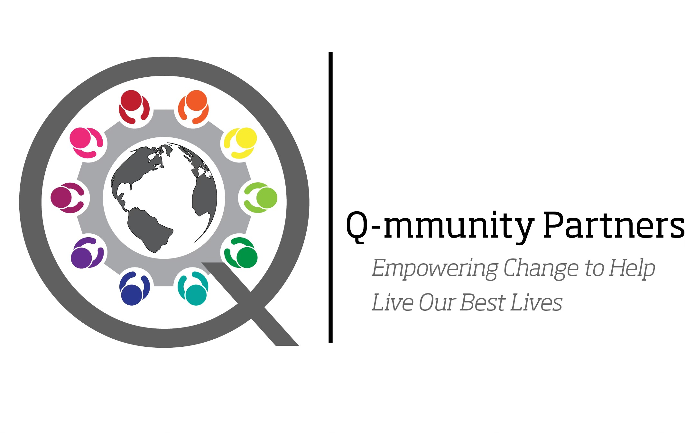

```markdown
# Empowering Q'mmunity Change



Welcome to Empowering Q'mmunity Change! We're a nonprofit organization dedicated to helping everyone in the "Q'ommunity" live their best lives. 

## Our Mission

Our mission is to provide support, resources, and community for all people who identify as part of the "Q'ommunity". We believe that everyone deserves to live a full, authentic life, and we're here to help make that happen.

## What We Do

At Empowering Q'mmunity Change, we:

- Provide supportive resources for mental health, physical health, and gender identity
- Organize community events and gatherings for the "Q'ommunity"
- Advocate for policies that support and protect the "Q'ommunity"

## Get Involved

There are many ways you can help support our mission:

- **Donate:** Your financial support helps us continue our important work. [TBD: Click here to donate.](donation_link)
- **Volunteer:** We always need volunteers for our events and programs. [TBD: Click here to learn more about volunteering.](volunteer_link)
- **Spread the Word:** Share our mission with your friends and family. [TBD: Click here for resources to help spread the word.](resources_link)

## Contact Us

We'd love to hear from you! 

- Email: [brad@empoweringqommunitychange.today](mailto:brad@empoweringqommunitychange.today)

---

© 2023 Empowering Q'mmunity Change. All rights reserved.
```
